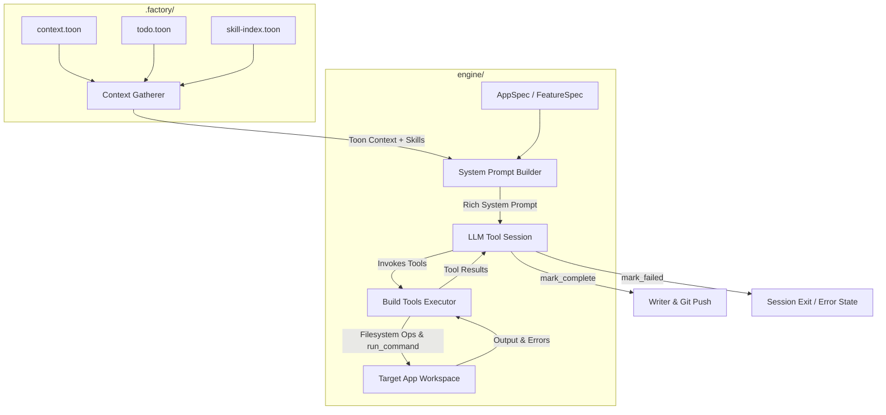

# ADR-001: Agentic Build Engine Upgrade & Tool-Calling Loop

* **Status**: Implemented / Approved
* **Date**: 2026-05-22
* **Authors**: Antigravity, Factory Core Engineering Team
* **Target Version**: v2.0.0
* **Scope**: Core LLM Engine, TOON Integration, CLI Facade, Developer/Agent Workflow

---

## Technical Context & Problem Statement

Historically, the Factory Build Engine used a rigid, linear plan → build → test → iterate pipeline. The LLM generated files sequentially, after which a separate script ran the validation checks (TypeScript compiler, linters, test runner) and passed errors back to the LLM for corrections.

This rigid pipeline suffered from multiple severe drawbacks:
1. **Blind Execution**: The generator had no access to the filesystem, compiler, or tests during the initial writing phase. It could not check what files were already present or verify imports.
2. **High Remediation Overhead**: If compiling failed, the engine had to collect complex error contexts and re-invoke the LLM. This led to high token consumption, slow execution, and frequent out-of-sync edits.
3. **Siloed CLI Shells**: Delegate tasks via CLI wrappers (like `pi`, `gemini`, `claude`, or `agy`) ran in isolated shells, making multi-turn error correction and automatic updates to repository context files near-impossible to track.

To address these core limitations, the engine was upgraded to an **autonomous, tool-calling agentic loop** where the LLM executes interactively within the workspace target directory.

---

## Decision & Approach (ADRs)

### 1. Interactive Tool-Calling LLM Loop
We replaced the hardcoded pipeline phases with an interactive multi-turn session (up to 50 turns). The LLM is provided with 12 specialized tools allowing it to inspect specifications, explore the repository, read/write/patch files, execute shell commands (e.g. package install, linter, TypeScript checking), and explicitly register completion or failures.

### 2. TOON Context Bridge
We standardized repository state, conventions, and task lists using the TOON format (`.factory/context/context.toon`, `heartbeat.toon`, `todo.toon`, `skill-index.toon`). 
- Local context is gathered dynamically.
- Large contexts are compressed using `@toon-format/cli` to keep them within prompt budgets.
- Autodiscovered project skills are formatted into a markdown table and injected into prompts.

### 3. Dual Execution Architecture
We support native function-calling with top-tier API providers (Gemini, OpenAI) and fallback to robust XML tag-based parsing (`<tool_call>...` or `<invoke>...`) for local models (Ollama) or custom terminal-based CLI agents (`pi`, `gemini`, `claude`, `agy`).

### 4. Strict Git Commit Verification Hook
We enforce a pre-commit verification hook checking that the committer (agent or developer) has a current `in_progress` task registered in `.factory/task-manager/todo.toon` and warning if the active heartbeat is stale (>30 minutes).

---

## Technical Specification & Architecture



### 1. Build Tools Schema (`engine/build-tools.ts`)

Every tool returns a `ToolResult` interface (`{ content: string; isError?: boolean }`) and never throws a fatal exception:

*   **`read_file`**: Reads content of a file. Capped at 100KB to prevent context window overflow.
*   **`write_file`**: Creates directories recursively and writes a complete file.
*   **`patch_file`**: Targets an exact section of a file (checks `old_content`) and replaces it with `new_content`. Returns an error if the old block is not found (forcing a read first).
*   **`delete_file`**: Removes a file from disk.
*   **`list_dir`**: Returns a newline-separated list of directories and files. Recursive option automatically filters out `.git`, `node_modules`, and `.next`.
*   **`search_files`**: A fast, regex/glob-filtered grep across files (max 50 results).
*   **`run_command`**: Executes a bash command in the target directory (default 120s timeout, stdout/stderr captured and capped at 50KB to prevent log flooding).
*   **`read_story`**: Returns the active specification YAML story.
*   **`read_blueprint`**: Reads `package.json`, `tsconfig.json`, local `conventions`, and `knowledge` files in a single call.
*   **`log_step`**: Appends progress logging inside the engine.
*   **`mark_complete`**: Signals that all compilation and lint checks have successfully passed and the build is verified. Terminates the session.
*   **`mark_failed`**: Signals that the build has failed and provides the reason code. Terminates the session.

### 2. Session Loop Mechanics (`engine/generate.ts`)

*   **Turn Cap**: Hard cap of 50 turns to prevent runaway model execution.
*   **Wall-Clock Timeout**: 20 minutes execution limit per session.
*   **Token Guard**: Activates at Turn 20. Truncates conversation logs to retain only the System Prompt, the Bootstrap User Message, and the last 15 messages (sliding window).
*   **Finality**: Requires an explicit `mark_complete` call. The engine does not guess success based on final text outputs.

### 3. CLI Facade Specifications

The main entry point `engine/cli.ts` acts as a dispatcher executing bash scripts that coordinate with active project repositories:
*   `factory pulse "<msg>"`: Ping `heartbeat.sh` script to log activity state.
*   `factory task <cmd> <args>`: Interface with `manage.sh` for listing, starting, and completing todo items.
*   `factory context update "<msg>"`: Sync messages to the compressed TOON worklog.
*   `factory validate`: Runs codebase static checking suites.
*   `factory hooks install`: Generates pre-commit and post-commit Git hooks.

### 4. UI Dashboard extensions (`ui/`)

*   **Heartbeat Monitor**: Cards polling `/api/heartbeat` mapping project activity age to status badges (Green <5m, Yellow 5-30m, Red >30m stale).
*   **Toon Context Viewer**: Raw monospace preview card of compressed context files.
*   **Skill Registry**: List of discovered scripts and capabilities.

---

## Protocols for AI Coding Agents (MANDATORY)

Any autonomous developer agent (including Antigravity, Pi, or Gemini) working on this codebase must strictly adhere to the following sequence:

### 1. Orientation & Task Startup
*   **Step 1**: Check for an active task by reading `.factory/task-manager/todo.toon`.
*   **Step 2**: If no task is in progress, identify the next pending task and start it:
    ```bash
    .factory/task-manager/manage.sh start <task_id>
    ```
*   **Step 3**: Send an initial pulse message to update the heartbeat:
    ```bash
    factory pulse "Starting task <task_id>: <task name>"
    ```

### 2. Implementation & Code Quality
*   **Production Code**: Always produce complete, production-ready code. Do not write placeholders, templates, stub files, or left-as-an-exercise comments.
*   **Read Before Modifying**: Never modify or patch a file without calling `read_file` or inspecting it first. This ensures exact matching of content blocks and prevents code regressions.
*   **Dependency Audits**: Ensure that any newly imported module or library is registered inside `package.json`.

### 3. Code Verification
Before attempting to commit, you must run the project check suite and guarantee that both exit with `0`:
1.  **TypeScript Static Compilation**:
    ```bash
    npx tsc --noEmit
    ```
2.  **Lint Verification**:
    ```bash
    npm run lint
    ```

### 4. Commit, Context Update & Task Completion
Once the checks are clean:
*   **Git Commit**: Format commits using structured guidelines:
    ```bash
    git add -A && git commit -m "feat(scope): detailed description"
    ```
*   **Update Context**: Log details about the changes into the TOON worklog:
    ```bash
    factory context update "Implemented <details>"
    ```
*   **Pulse Status**: Pulse git success:
    ```bash
    factory pulse "Successfully committed changes"
    ```
*   **Mark Task Complete**:
    ```bash
    .factory/task-manager/manage.sh complete --id <task_id> --summary "Detailed summary of modifications"
    ```
